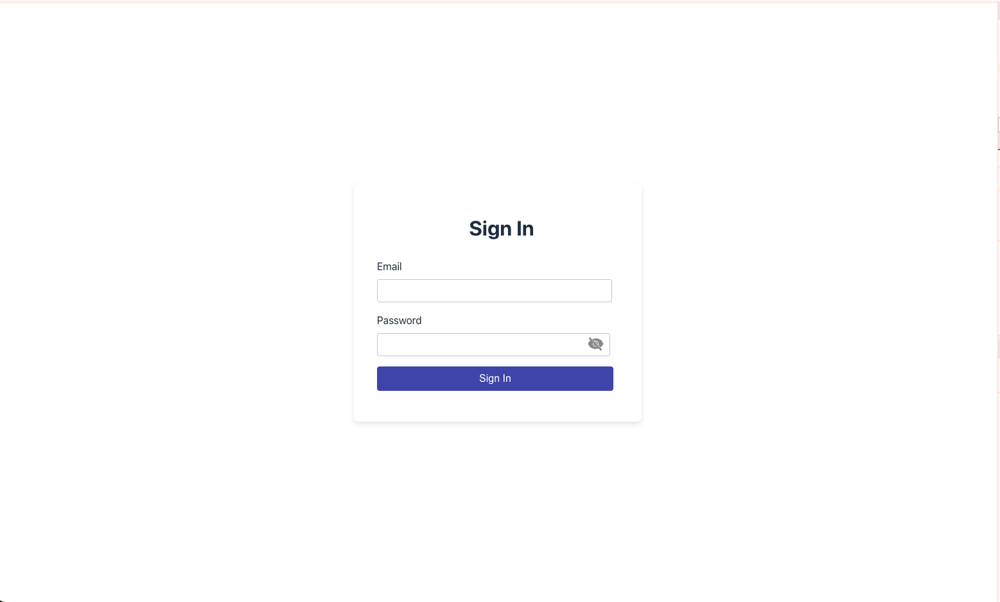

# Login Component

<p align="center">
  <br>
  
  
  <br>
  <br>
</p>

## Features

- **Customizable**: Easily adjust colors, text, and behaviors via props.
- **Event Handling**: Emit events for sign-in actions to integrate with parent components.
- **Responsive Design**: Adapts to different screen sizes for seamless user interaction.

## Installation

To get started with this project, follow these steps:

1. **Clone the repository:**

   ```bash
   git clone https://github.com/jasunakumdev/login-component.git

   cd login-component
   ```

2. ## Install dependencies:

   ```bash
   npm install or yarn install
   ```

# Development

Run the development server

```bash
npm run dev or
yarn dev
```

# Build

To build your project for production:

```bash
npm run build or
yarn build
```

# Lit Element Login Component

This repository contains a reusable login component built with Lit Element, designed to be easily integrated into various JavaScript frameworks.

## Component Properties

### `backgroundImage: string`

- **Type:** `string`
- **Description:** Specifies the URL of the background image for the login screen.
- **Default:** `''` (empty string)

### `backgroundColor: string`

- **Type:** `string`
- **Description:** Sets the background color of the login screen.
- **Default:** `''` (empty string)

### `errorMessage: string`

- **Type:** `string`
- **Description:** Error message displayed for invalid credentials or other errors.
- **Default:** `''` (empty string)

### `invalidCredentials: boolean`

- **Type:** `boolean`
- **Description:** Flag indicating whether credentials entered are invalid.
- **Default:** `false`

### `buttonColor: string`

- **Type:** `string`
- **Description:** Color of the sign-in button.
- **Default:** `'#3f51b5'`

### `loginTitle: string`

- **Type:** `string`
- **Description:** Title displayed above the login form.
- **Default:** `'Sign In'`

### `buttonText: string`

- **Type:** `string`
- **Description:** Text displayed on the sign-in button.
- **Default:** `'Sign In'`

### `emailTitle: string`

- **Type:** `string`
- **Description:** Label text for the email input field.
- **Default:** `'Email'`

### `passwordTitle: string`

- **Type:** `string`
- **Description:** Label text for the password input field.
- **Default:** `'Password'`

### `showPassword: boolean`

- **Type:** `boolean`
- **Description:** Flag indicating whether to show or hide the password field.
- **Default:** `true`

### `onSignIn: Function`

- **Type:** `Function`
- **Description:** Callback function triggered when the user attempts to sign in.
- **Default:** Empty arrow function `() => {}`
-

## Examples

### VanilaJS

import login-lit-component

```
<script type="module">
   import 'login-lit-component'
</script>
```

```
<login-screen
   id="login"
   errorMessage="Invalid username or password!!"
></login-screen>
```

Bind Event

```
<script>
      const loginScreen = document.querySelector('#login')
      loginScreen.addEventListener('signin', handleSignIn)
      function handleSignIn(event) {
        const { email, password } = event.detail
        if (email === 'test@gmail.com' && password === 'Test@123') {
          loginScreen.invalidCredentials = false
          console.log('Authentication successful')
        } else {
          loginScreen.invalidCredentials = true
        }
      }
</script>
```

### React

```
import { LoginComponent } from 'login-lit-component'
import { createComponent, EventName } from '@lit/react'

export const MyLoginComponent = createComponent({
  tagName: 'login-component',
  elementClass: LoginComponent,
  react: React,
  events: {
    onSignIn: 'signin' as EventName<MouseEvent>,
  },
})

function App() {
  const handleSignIn = () => {
    console.log('Signin event')
  }

  return (
      <MyLoginComponent
        onSignIn={handleSignIn}
        loginTitle="Hello"
      ></MyLoginComponent>
  )
}

```

### Angular

app.component.ts

```

export class AppComponent {
  invalidCredentials: boolean

  handleSignIn(event){
    const { email, password } = event.detail
    if (email === 'test@gmail.com' && password === 'Test@123') {
      loginScreen.invalidCredentials = false
      console.log('Authentication successful')
    } else {
      loginScreen.invalidCredentials = true
    }
  }
}
```

app.component.html

```
<login-component
  [invalidCredentials]="invalidCredentials"
  (signin)="handleSignIn($event)"
  errorMessage="Invalid username and password"
>
```

</login-component>
